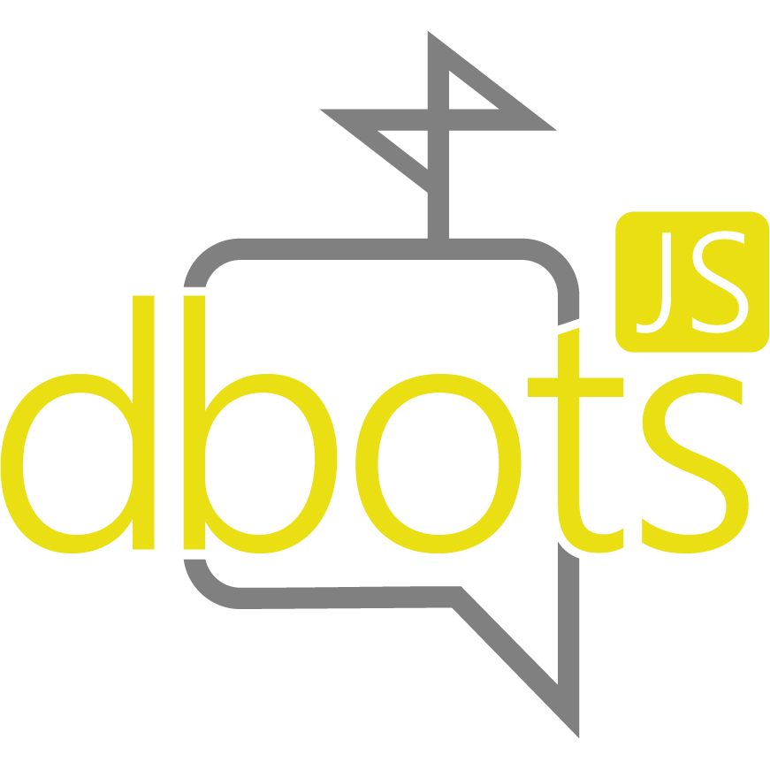

<div align="center">
  <p>
    
  </p>
  <p>A stats poster and API wrapper for all botlists.</p>
  <p>
    <a href="https://www.npmjs.com/package/dbots"></a>
    <a href="https://github.com/dbots-pkg/dbots.js/network/dependents?package_id=UGFja2FnZS0zNzA1MzQ1MA%3D%3D"></a>
    <a href="https://www.npmjs.com/package/dbots"></a>
    <a href="https://david-dm.org/dbots-pkg/dbots.js"></a>
    <br/>
    <a href="https://github.com/dbots-pkg/dbots.js/actions?query=workflow%3A%22Source+code+linting%22"></a>
    <a href="https://github.com/dbots-pkg/dbots.js/actions?query=workflow%3A%22TS+definitions%22"></a>
    <a href="https://lgtm.com/projects/g/dbots-pkg/dbots.js/context:javascript"></a>
  </p>
  <p>
    <a href="https://nodei.co/npm/dbots/"></a>
  </p>
</div>

<!-- omit in toc -->
# Table of Contents
- [About](#about)
- [Installing](#installing)
- [Examples](#examples)
  - [Example with client](#example-with-client)
  - [Example without client](#example-without-client)
- [Supported Libraries](#supported-libraries)
- [Supported Services](#supported-services)
- [Changelog](#changelog)
- [Contribution](#contribution)
- [Other Links](#other-links)

## About
`dbots` helps [Discord](https://discordapp.com) bot developers group all your statistic posting needs into one poster, complete with seperate posting, API wrappers for supported lists, and an interval to post to all services every `n` seconds.

## Installing
You can install dbots by running this command:
```sh
# Stable
npm i dbots
yarn add dbots

# Master
npm i dbots-pkg/dbots.js#master
yarn add ssh://github.com/dbots-pkg/dbots.js#master
```

## Examples

### Example with client
```js
const Discord = require('discord.js');
const client = new Discord.Client();
const dbots = require('dbots');
const poster = new dbots.Poster({
    client,
    apiKeys: {
        discordbotsgg: '…',
        topgg: '…',
        lsterminalink: '…',
        carbon: '…'
    },
    clientLibrary: 'discord.js'
});

poster.startInterval(); // starts an interval thats posts to all services every 30 minutes
```

### Example without client
```js
const dbots = require('dbots');
const poster = new dbots.Poster({
    apiKeys: {
        discordbotsgg: '…',
        topgg: '…',
        lsterminalink: '…',
        carbon: '…'
    }
});

poster.post('carbon') // if the service is undefined, it posts to all services provided with a key
```

## Supported Libraries
Creator     | Name
----------- | -----
discordjs (originally from hydrabolt)   | [](https://npmjs.com/discord.js) [](https://github.com/discordjs/discord.js) discord.js
izy521      | [](https://npmjs.com/discord.io) [](https://github.com/izy521/discord.io) discord.io
qeled       | [](https://npmjs.com/discordie) [](https://github.com/qeled/discordie) discordie
abalabahaha | [](https://npmjs.com/eris) [](https://github.com/abalabahaha/eris) eris

## Supported Services
The supported services list has been moved into the website.  
You can see a full (and automatically updated) list of usables services [here](https://dbots.js.org/#/docs/main/latest/general/services).

## Changelog
You can see the changelog for every version [here](https://dbots.js.org/#/docs/main/latest/general/changelog).

## Contribution
Any contribution may be useful for the package! Make sure when making issues or PRs that the issue has not been addressed yet in a past issue/PR.

## Other Links
- [NPM](https://npmjs.org/package/dbots)
- [Yarn](https://yarn.pm/dbots)
- [JSDelivr](https://www.jsdelivr.com/package/npm/dbots)
- [David (Dependency Watcher)](https://david-dm.org/dbots-pkg/dbots.js)
- [Website](https://dbots.js.org) ([source](https://github.com/dbots-pkg/dbots-pkg.github.io))
- [Documentation](https://dbots.js.org/#/docs)
- [Dbots GitHub Organization](https://github.com/dbots-pkg)
